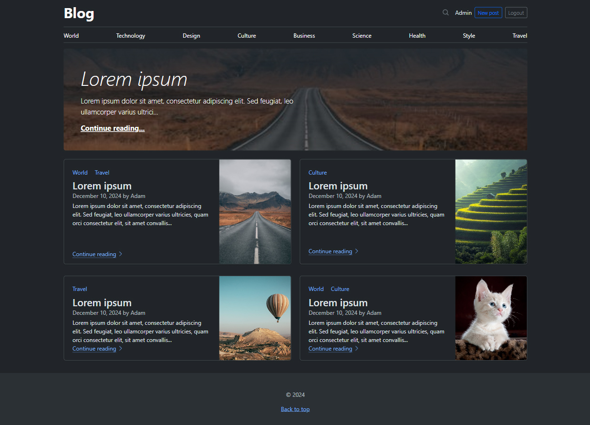
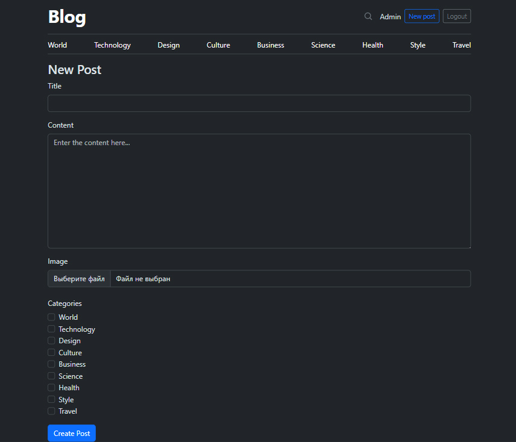
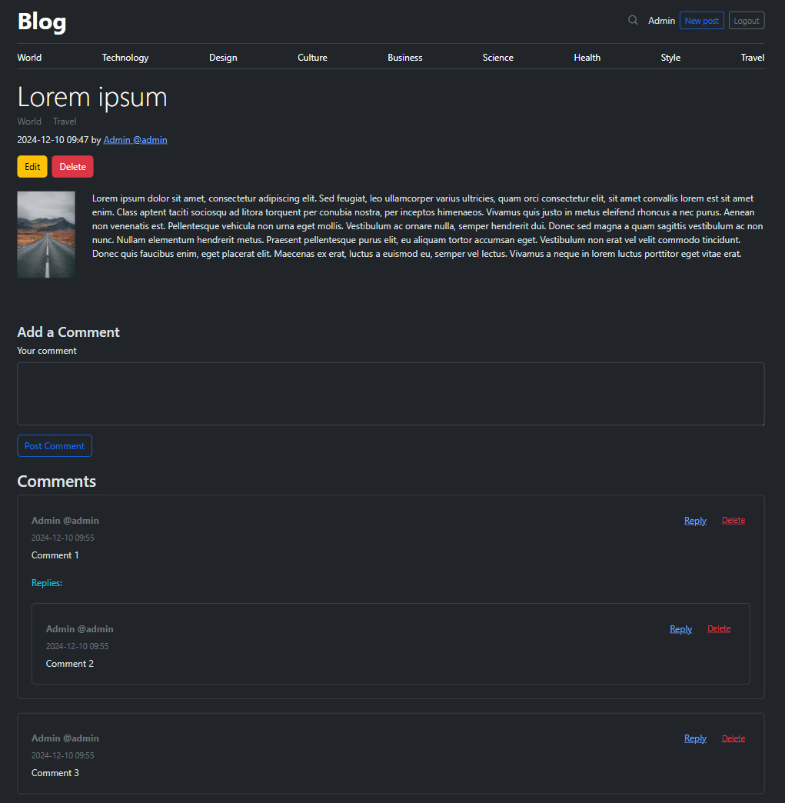

<h1 align="center">Symfony blog</h1>
<p align="center">Blogging platform built with PHP (Symfony) and styled using Bootstrap. </p>
<p align="center">This application allows users to register using email, create, edit, and delete posts, write comments, delete comments, and organize comments in a nested structure.</p>

<p align="center">



</p>

## Running locally:
#### Fresh setup:
```bash
cp .env.example .env && \
composer install && \
php bin/console secrets:generate-keys && \
php bin/console asset-map:compile && \
php bin/console cache:pool:clear --all && \
php bin/console doctrine:database:create && \
php bin/console doctrine:schema:update --force && \
php bin/console doctrine:fixtures:load
```
Type "yes" when prompted
``Careful, database "main" will be purged. Do you want to continue? (yes/no)``

#### Starting server:
```bash
symfony server:start
```

```bash
php bin/console messenger:consume async
```

#### Default users:
```
admin@example.com
123123

user@example.com
123123
```


## Testing:
```bash
php bin/console --env=test doctrine:database:drop --force && \
php bin/console --env=test doctrine:database:create && \
php bin/console --env=test doctrine:schema:update --force && \
php bin/console --env=test doctrine:fixtures:load --append && \
php bin/phpunit --testdox
```